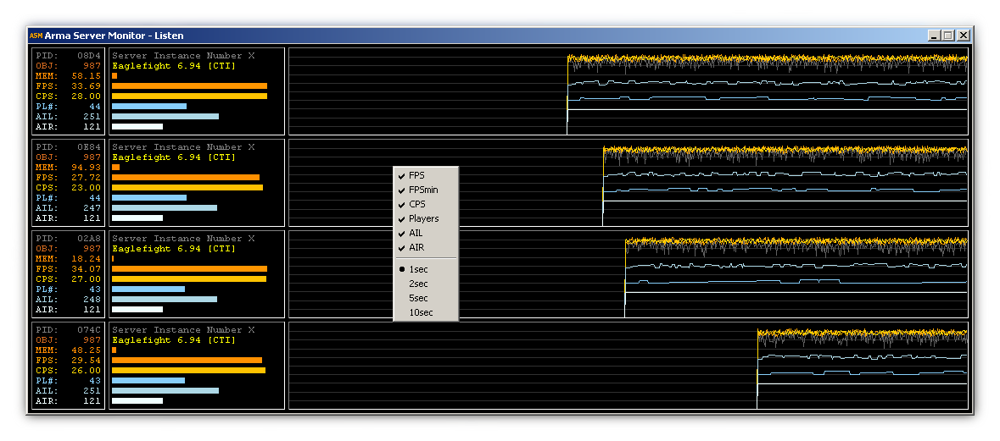

#Arma Server Monitor#

"Arma Server Monitor" is originally a spin-off of my experiments with the arma engine.

----------

Propertys:

	- monitors up to 4 server (or headless client) instances simultaneous 
	- introduces a performance value CPS for FSM processing analysis
	- very simple, compact and solid design
	- almost no influence to cpu load
	- easy to use (mini addon)
	- customizable history graphs	

----------

Currently able to monitor the following values:

	- PID process ID of the server instance
	- OBJ number of all objects in current mission (allMissionObjects)
	- MEM Amount of allocated physical memory
	- FPS (on a server this means simulation cycles per second)
	- FPSmin (the minimum FPS of the last 16 cycles, hist. graph only)
	- CPS Condition-evaluation per Second (rel. to AI response delay, VM load)
	- PL# Number of alive player units
	- AIL Number of alive server local AI units
	- AIR Number of alive AI units on connected machines (remote)
	- Name of the currently played mission (missionName)
	- Name of the instance profile (profileName)

----------

**Arma Server Monitor** consists of 3 components:

	fn_ASM.fsm 				- Reports some internal performance states from arma server (or HC)
	ASMdll.dll 				- Interfaces to ArmaServerMonitor.exe via shared memory
	ArmaServerMonitor.exe 	- The Monitor itself reads from MMF and displays the values
	
-------

This tool is very helpful to monitor your server under load, to spot bad coded parts in your mission/mod in realtime.    
It will give you an impression, how well your server/mission scale with player/AI/object numbers.

Additional to the history graph of FPS value, now the value **FPSmin** is drawed as a graph.
By watching this graphs you can **easily spot lags** on your server, without being in game.

Alongside to the well known FPS (frames per second), an very interesting value **CPS** is introduced here.    
**CPS** is expressed by **condition** **evalations** per **second** and measured from an reference condition in `fn_ASM.fsm`. You can realize this **CPS** value as the reciprocal of the current "minimal response delay" of local AI in the running mission.    

By watching the number of mission-objects (OBJ), you can check if your cleanup-routine is working well.    
( to enable object counting, set *objectcountinterval* in asm.ini to a value > 0 [sec] )

**Additional**, it is now possible to **connect** to `Arma Server Monitor` **from remote** via TCP.   

----------

**How to use ASM:**

Extract this file: [https://github.com/fred41/ASM/blob/master/addon/ASM.zip](https://github.com/fred41/ASM/blob/master/addon/ASM.zip)    to your Arma 3 root folder.

Add **-mod=@ASM** to your server (or HC) launch params.     

Run `ArmaServerMonitor.exe` from what directory you want, to monitor all your server (or HC) instances locally.

To watch your server from a remote device, you need an ASM instance on that device too and to configure it per start params as client.     
Default start params for `ArmaServerMonitor.exe` are: `-server -n1 -h127.0.0.1 -p24000`   
This means, ASM starts as monitoring server and listens at TCP port 24000, max. allowed remote clients = 1.

Example for client configuration: `ArmaServerMonitor.exe -client -h201.178.1.102 -p24000`

That means ASM starts as monitoring client and tries periodical to connect/read to/from your ASM  server at 201.178.1.102:24000.   
If your server is firewall protected, you have to open the selected TCP port on server.

Use the right mouse button over the history graphs to configure the visibility of graphs (popup menu).

**If you prefer to run your DS instance(s) as service, you have to start ArmaServerMonitor with admin rights**     

*ENJOY :)*     

----------

Changelog:    
01.06.2013 Changed the install/launch method to **mini-addon** (thanks terox for inspiration)    
01.06.2013 Fixed: instance occupied additional slot at mission change    
02.06.2013 Changed bar graphs for CPS & FPS to **logarithmic scale** to show states more intuitive   
03.06.2013 Added **history graphs**, customizable (individual visibility, update interval), transparency switch    
05.06.2013 Finished ... or not ...  
08.06.2013 Custom build for use with DS running as service added   
11.06.2013 Fixed: AI was not counted correctly    
13.06.2013 running DS as **service** now merged in default build (custom build removed)    
17.06.2013 **remote monitoring** now available via additional ASM instance, configured per start params      
18.06.2013 Amount of allocated physical memory in [MB], **MEM** added      
04.07.2013 graphs for player number adapted from 50 to 100    
05.07.2013 history graph extd., better lag visualisation via FPSmin (popup menu)     
09.07.2013 some performance related improvements          
11.07.2013 profilName now displayed additional to missionName; forced=1 -> preInit=1 in cfgFunctions      
15.07.2013 counter for allMissionObjects added, helps to check if cleanup routines works                  
31.07.2013 object counting interval, configurable in **asm.ini** [seconds], set *objectcountinterval=0* to deactivate (default)          
